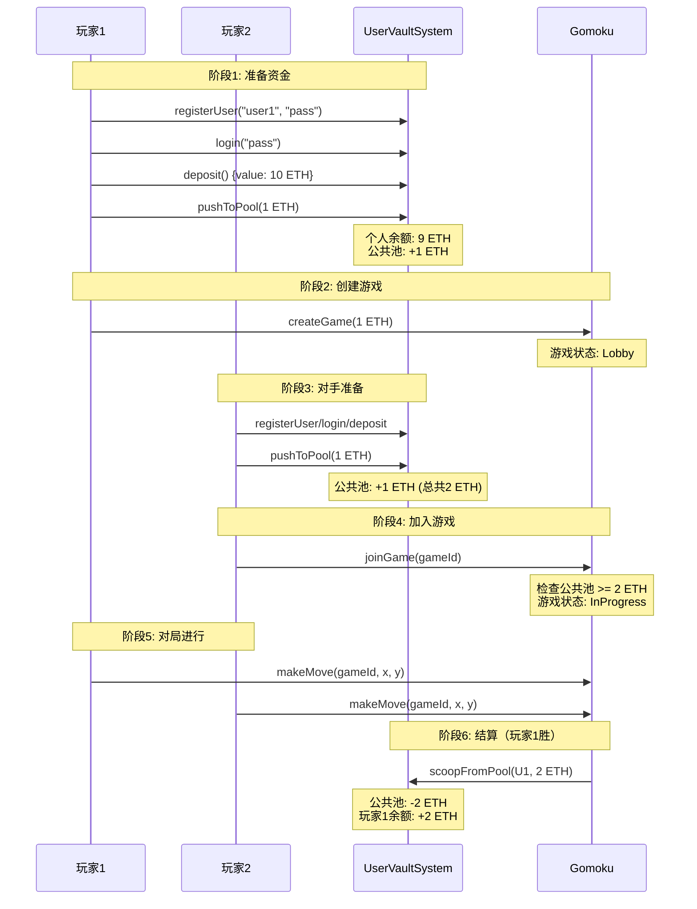

# Web3 五子棋 DApp - 智能合约

本项目包含了去中心化五子棋 (Gomoku) DApp 的智能合约系统，使用 Hardhat 作为开发环境，构建于以太坊兼容区块链之上。

该系统采用**公共池资金流模型**，玩家先将资金质押到公共池，游戏合约在结算时从池中划转资金给胜者或平分给双方。

---

## 📋 目录

- [系统架构](#系统架构)
- [核心特性](#核心特性)
- [资金流模型](#资金流模型)
- [环境设置](#环境设置)
- [使用指南](#使用指南)
- [部署流程](#部署流程)
- [用户交互流程](#用户交互流程)
- [安全考量](#安全考量)
- [测试](#测试)
- [许可证](#许可证)

---

## 🏗️ 系统架构

项目包含两个核心智能合约：

### 1. **`UserVaultSystem.sol`** - 用户资金管理系统
负责：
- 用户注册、登录、密码管理
- 用户个人余额管理（充值、提现）
- **公共游戏池 (`gamePoolBalance`)** 管理
- 白名单管理（控制哪些游戏合约可以从池中划转资金）

### 2. **`Gomoku.sol`** - 五子棋游戏合约
负责：
- 游戏创建与加入
- 棋盘状态管理（15x15）
- 落子逻辑与胜负判定（横、竖、斜四个方向的五连珠检测）
- 超时判负、认输、取消游戏等健壮性功能
- 游戏结算（通过 `UserVaultSystem` 的公共池划转资金）

---

## ✨ 核心特性

### 游戏功能
- ✅ 标准 15×15 五子棋规则
- ✅ 基于赌注的对战系统
- ✅ 自动胜负判定（横、竖、两条对角线）
- ✅ 平局检测（225 手棋满盘）
- ✅ **超时判负**：每步棋 90 秒限时，超时对手可索赔胜利
- ✅ **主动认输**：玩家可随时认输结束游戏
- ✅ **取消游戏**：创建者可在未开始前取消并退回赌注

### 安全特性
- 🔒 遵循 CEI 模式（Checks-Effects-Interactions）防止重入攻击
- 🔒 严格的访问控制和状态验证
- 🔒 白名单机制保护资金池
- 🔒 事件完整记录所有关键操作

---

## 💰 资金流模型

### 与旧版本的区别

**旧模型**（已废弃）：
```
用户 -> Gomoku 合约持有资金 -> 结算时转回用户
```

**新模型**（当前版本）：
```
用户个人余额 -> 公共池 (UserVaultSystem.gamePoolBalance) -> 胜者/平分
```

### 详细流程



---

## 🛠️ 环境设置

### 环境要求

- **Node.js** >= 18.0.0
- **NPM** 或 **Yarn**
- **MetaMask** 或其他 Web3 钱包

### 安装依赖

```bash
# 克隆仓库
git clone <YOUR_REPOSITORY_URL>
cd Web3Gomoku

# 安装依赖
npm install
```

### 项目配置

创建 `.env` 文件（不要提交到 Git）：

```env
# RPC 节点
SEPOLIA_RPC_URL="https://eth-sepolia.g.alchemy.com/v2/YOUR_API_KEY"

# 部署账户私钥（务必保密！）
PRIVATE_KEY="your_private_key_without_0x_prefix"

# Etherscan API Key（用于合约验证）
ETHERSCAN_API_KEY="your_etherscan_api_key"
```

---

## 📚 使用指南

### 编译合约

```bash
npx hardhat compile
```

### 运行测试

```bash
npx hardhat test
```

测试覆盖：
- ✅ 游戏创建与加入
- ✅ 落子与回合管理
- ✅ 胜负判定（四个方向）
- ✅ 平局检测
- ✅ 超时判负
- ✅ 认输与取消游戏
- ✅ 资金流正确性
- ✅ 公共池余额检查
- ✅ 权限控制

---

## 🚀 部署流程

### 方式一：完整自动部署（推荐）

一键完成所有步骤，包括白名单配置：

```bash
npx hardhat run scripts/deployComplete.js --network sepolia
```

脚本会自动：
1. 部署 `UserVaultSystem`
2. 部署 `Gomoku`
3. 将 `Gomoku` 加入白名单
4. 验证配置正确性

### 方式二：分步部署

#### 步骤 1: 部署 UserVaultSystem

```bash
npx hardhat run scripts/deployUserVault.js --network sepolia
```

📝 **记录输出的合约地址**

#### 步骤 2: 部署 Gomoku

1. 编辑 `scripts/deploy.js`，将 `USER_VAULT_ADDRESS` 改为上一步的地址
2. 运行部署脚本：

```bash
npx hardhat run scripts/deploy.js --network sepolia
```

📝 **记录 Gomoku 合约地址**

#### 步骤 3: 配置白名单（⚠️ 关键步骤）

**必须完成此步骤，否则游戏无法结算！**

使用 `UserVaultSystem` 的 **owner 账户**执行以下操作之一：

**方法 A: Hardhat Console**
```bash
npx hardhat console --network sepolia
```

```javascript
const uvs = await ethers.getContractAt("UserVaultSystem", "0x<UserVaultSystem地址>");
await uvs.addToWhitelist("0x<Gomoku地址>");

// 验证
await uvs.isAdmin("0x<Gomoku地址>"); // 应返回 true
```

**方法 B: Etherscan**
1. 访问 UserVaultSystem 合约页面
2. 连接 owner 钱包（部署合约的账户）
3. 进入 "Write Contract" 选项卡
4. 调用 `addToWhitelist` 函数，参数填入 Gomoku 合约地址
5. 确认交易

**方法 C: 自定义脚本**
```javascript
const { ethers } = require("hardhat");

async function main() {
  const uvsAddress = "0x<UserVaultSystem地址>";
  const gomokuAddress = "0x<Gomoku地址>";
  
  const uvs = await ethers.getContractAt("UserVaultSystem", uvsAddress);
  const tx = await uvs.addToWhitelist(gomokuAddress);
  await tx.wait();
  
  console.log("✅ 白名单配置完成");
}

main();
```

---

## 🎮 用户交互流程

### 前端集成流程

```javascript
// 1. 连接合约
const userVault = new ethers.Contract(USER_VAULT_ADDRESS, UserVaultABI, signer);
const gomoku = new ethers.Contract(GOMOKU_ADDRESS, GomokuABI, signer);

// 2. 用户注册与登录（首次使用）
await userVault.registerUser("username", "password");
await userVault.login("password");

// 3. 充值到个人余额
await userVault.deposit({ value: ethers.parseEther("10") });

// 4. 玩家1创建游戏
const stake = ethers.parseEther("1");
await userVault.pushToPool(stake);        // 先推入公共池
await gomoku.createGame(stake);           // 再创建游戏
const gameId = 1; // 从事件获取

// 5. 玩家2加入游戏
await userVault.pushToPool(stake);        // 先推入公共池
await gomoku.joinGame(gameId);            // 再加入游戏

// 6. 对局中
await gomoku.makeMove(gameId, 7, 7);      // 落子

// 7. 特殊操作
await gomoku.forfeit(gameId);             // 认输
await gomoku.claimWinByTimeout(gameId);   // 索赔超时胜利
await gomoku.cancelGame(gameId);          // 取消游戏（仅创建者，Lobby状态）

// 8. 提现
await userVault.withdraw(ethers.parseEther("5"));
```

### 关键注意事项

⚠️ **资金操作顺序**：
- 必须先 `pushToPool`，再 `createGame` / `joinGame`
- 合约无法强制验证用户是否预存了足够资金
- 如果用户未预存或金额不足，游戏结算时会失败

⚠️ **公共池竞争**：
- 公共池为全局共享
- 多个游戏同时进行时，可能出现池余额不足
- `joinGame` 会检查池余额，但并发结算时仍可能失败

⚠️ **白名单未配置**：
- 如果忘记将 Gomoku 加入白名单，所有游戏结算都会失败
- 部署后务必验证 `userVault.isAdmin(gomokuAddress)` 返回 `true`

---

## 🔒 安全考量

### 已实现的安全机制

✅ **CEI 模式**（Checks-Effects-Interactions）
- 所有涉及外部调用的函数都遵循 CEI 模式
- 先完成所有状态更新，最后才调用外部合约
- 有效防止重入攻击

✅ **严格的访问控制**
- 每个函数都有详细的权限检查
- 状态转换有明确的 require 验证
- Debug 函数限制为 owner 可调用

✅ **边界检查**
- 棋盘坐标验证（0-14）
- 数组访问安全检查
- 重复落子检测

✅ **时间戳管理**
- 记录每步棋的时间
- 超时判定防止游戏卡死

### 已知风险与限制

⚠️ **无强制资金验证**
- 合约无法验证用户是否真的预存了足够的钱
- 依赖前端正确引导用户操作流程
- 解决方案：前端在调用 `createGame`/`joinGame` 前检查公共池余额

⚠️ **公共池资金竞争**
- 多个游戏共享一个公共池
- 可能出现"超卖"情况（承诺的赌注总额 > 池余额）
- 部分缓解：`joinGame` 前检查 `poolBalance >= stake * 2`
- 根本解决需要修改 `UserVaultSystem` 实现逐游戏锁定

⚠️ **UserVaultSystem 的重入漏洞**
- `withdraw` 函数存在重入攻击风险（先转账，后更新余额）
- 虽然不影响 Gomoku 合约本身，但威胁整个系统资金安全
- **强烈建议在生产环境部署前修复此漏洞**

---

## 🧪 测试

### 运行所有测试

```bash
npx hardhat test
```

---

## 🔧 本地部署验证

本地部署验证可以在不消耗真实资金的情况下，完整测试合约的部署流程和功能。

### 步骤 1: 安装依赖

```bash
# 克隆项目后首次运行
npm install

# 如果遇到依赖冲突，使用以下命令
npm install --legacy-peer-deps
```

**注意事项**：
- 项目使用 Hardhat 2.x（稳定版本）
- 配置文件和脚本使用 CommonJS 语法（`require`/`module.exports`）
- 如果 package.json 中有 `"type": "module"`，Hardhat 2.x 会报错

### 步骤 2: 编译合约

```bash
npx hardhat compile
```

**预期输出**：
```
Compiled 4 Solidity files successfully (evm target: paris).
```

**常见问题**：

**Q: 遇到 SSL 证书错误**
```
Error HH502: Couldn't download compiler version list.
Caused by: Error: unable to get local issuer certificate
```

**解决方案**（仅开发环境）：
```bash
NODE_TLS_REJECT_UNAUTHORIZED=0 npx hardhat compile
```

### 步骤 3: 启动本地 Hardhat 节点

在**新的终端窗口**中运行：

```bash
npx hardhat node
```

这会启动一个本地以太坊节点，并自动创建 20 个测试账户，每个账户有 10,000 ETH。

**预期输出**：
```
Started HTTP and WebSocket JSON-RPC server at http://127.0.0.1:8545/

Accounts
========
Account #0: 0xf39Fd6e51aad88F6F4ce6aB8827279cffFb92266 (10000 ETH)
Private Key: 0xac0974bec39a17e36ba4a6b4d238ff944bacb478cbed5efcae784d7bf4f2ff80
...
```

⚠️ **保持此终端窗口运行**，不要关闭。

### 步骤 4: 部署合约到本地网络

在**另一个终端窗口**中运行：

```bash
npx hardhat run scripts/deployComplete.js --network localhost
```

这个脚本会**自动完成**：
1. ✅ 部署 `UserVaultSystem` 合约
2. ✅ 部署 `Gomoku` 合约
3. ✅ 将 `Gomoku` 加入 `UserVaultSystem` 白名单
4. ✅ 验证配置正确性

**预期输出**：
```
==================== 开始部署流程 ====================
部署账户: 0xf39Fd6e51aad88F6F4ce6aB8827279cffFb92266
账户余额: 10000.0 ETH

📦 步骤 1/4: 部署 UserVaultSystem 合约...
✅ UserVaultSystem 已部署到: 0x5FbDB2315678afecb367f032d93F642f64180aa3
   - Owner: 0xf39Fd6e51aad88F6F4ce6aB8827279cffFb92266
   - 初始公共池余额: 100.0 ETH

📦 步骤 2/4: 部署 Gomoku 合约...
✅ Gomoku 已部署到: 0xe7f1725E7734CE288F8367e1Bb143E90bb3F0512
   - UserVault 引用地址: 0x5FbDB2315678afecb367f032d93F642f64180aa3
   - Owner: 0xf39Fd6e51aad88F6F4ce6aB8827279cffFb92266 

🔑 步骤 3/4: 将 Gomoku 合约加入 UserVaultSystem 白名单...
✅ 白名单配置成功
   - 交易哈希: 0x8df08c93805270de8f85dd00ab281859982f3c885b95414139269fcbc8484502 

🔍 步骤 4/4: 验证部署与配置...
   - Gomoku 是否在白名单中: ✅ 是

==================== 部署成功 ====================
📝 合约地址总结：
   UserVaultSystem: 0x5FbDB2315678afecb367f032d93F642f64180aa3
   Gomoku:          0xe7f1725E7734CE288F8367e1Bb143E90bb3F0512
```

### 步骤 5: 与合约交互（可选）

使用 Hardhat Console 与部署的合约交互：

```bash
npx hardhat console --network localhost
```

在控制台中执行：

```javascript
// 连接到已部署的合约（使用上一步输出的地址）
const userVault = await ethers.getContractAt(
  "UserVaultSystem", 
  "0x5FbDB2315678afecb367f032d93F642f64180aa3"
);

const gomoku = await ethers.getContractAt(
  "Gomoku", 
  "0xe7f1725E7734CE288F8367e1Bb143E90bb3F0512"
);

// 验证白名单配置
await userVault.isAdmin(await gomoku.getAddress());
// 应返回: true

// 检查公共池余额
await userVault.gamePoolBalance();
// 应返回: 100000000000000000000n (100 ETH)

// 获取测试账户
const [owner, player1, player2] = await ethers.getSigners();

// 模拟用户注册
await userVault.connect(player1).registerUser("Alice", "password123");
await userVault.connect(player1).login("password123");

// 充值到个人余额
await userVault.connect(player1).deposit({ value: ethers.parseEther("5") });

// 检查余额
const info = await userVault.connect(player1).getUserInfo();
console.log("用户名:", info.username);
console.log("余额:", ethers.formatEther(info.balance), "ETH");

// 推入公共池
await userVault.connect(player1).pushToPool(ethers.parseEther("1"));

// 创建游戏
await gomoku.connect(player1).createGame(ethers.parseEther("1"));

// 获取游戏详情
const game = await gomoku.getGameDetails(1);
console.log("游戏创建者:", game.players[0]);
console.log("赌注:", ethers.formatEther(game.stake), "ETH");
```

### 步骤 6: 运行测试（可选）

```bash
npx hardhat test --network localhost
```

### 本地部署验证总结

| 检查项 | 命令 | 预期结果 |
|--------|------|---------|
| 依赖安装 | `npm install` | 无错误 |
| 合约编译 | `npx hardhat compile` | 4 个文件编译成功 |
| 本地节点 | `npx hardhat node` | 显示 20 个测试账户 |
| 合约部署 | `npx hardhat run scripts/deployComplete.js --network localhost` | 显示两个合约地址 |
| 白名单验证 | Console: `userVault.isAdmin(gomokuAddress)` | 返回 `true` |

### 常见问题排查

#### Q1: 编译时下载编译器失败

**错误**：
```
Error HH502: Couldn't download compiler version list.
```

**解决方案**：
```bash
# 方法1: 使用环境变量（仅开发）
NODE_TLS_REJECT_UNAUTHORIZED=0 npx hardhat compile

# 方法2: 检查网络连接
# 方法3: 使用代理（如需要）
```

#### Q2: 部署脚本报模块错误

**错误**：
```
SyntaxError: Named export 'ethers' not found
```

**原因**：Hardhat 2.x 需要 CommonJS 语法

**解决方案**：
确保 `package.json` 中**没有** `"type": "module"`，脚本使用 `require` 而非 `import`

#### Q3: 无法连接到 localhost 网络

**错误**：
```
Error: could not detect network
```

**解决方案**：
1. 确保本地节点正在运行（`npx hardhat node`）
2. 检查节点日志确认监听在 `http://127.0.0.1:8545`
3. 重启本地节点

#### Q4: 白名单配置失败

**错误**：
```
Not owner or whitelist
```

**原因**：部署账户不是 UserVaultSystem 的 owner

**解决方案**：
确保使用相同的账户部署两个合约并配置白名单（`deployComplete.js` 已自动处理）

---

### 测试覆盖范围

| 模块 | 测试项 | 状态 |
|------|--------|------|
| 创建游戏 | 基本创建、资金转入池、stake为0、重复创建 | ✅ |
| 加入游戏 | 基本加入、池余额检查、错误状态 | ✅ |
| 落子逻辑 | 正常落子、回合验证、时间戳更新 | ✅ |
| 胜负判定 | 横向五连、其他三个方向 | ✅ |
| 平局 | 225手满盘 | ✅ |
| 超时判负 | 90秒超时、未超时拒绝 | ✅ |
| 认输功能 | 任一玩家认输 | ✅ |
| 取消游戏 | Lobby状态取消、非创建者拒绝 | ✅ |
| 资金结算 | 胜者获得双倍、平局退回、取消退回 | ✅ |
| 权限控制 | Debug函数仅owner可调用 | ✅ |

### 测试公共池资金流

```javascript
describe("资金流测试", function () {
  it("应正确处理公共池资金流", async function () {
    const stake = ethers.parseEther("1");
    
    // 1. 玩家1预存并创建游戏
    await mockUserVault.connect(player1).pushToPool(stake);
    await gomoku.connect(player1).createGame(stake);
    
    expect(await mockUserVault.gamePoolBalance()).to.equal(stake);
    
    // 2. 玩家2预存并加入
    await mockUserVault.connect(player2).pushToPool(stake);
    await gomoku.connect(player2).joinGame(1);
    
    expect(await mockUserVault.gamePoolBalance()).to.equal(stake * 2n);
    
    // 3. 玩家1胜利
    // ... 落子逻辑 ...
    
    // 4. 验证结算
    expect(await mockUserVault.userBalances(player1)).to.equal(initialBalance + stake);
    expect(await mockUserVault.gamePoolBalance()).to.equal(0);
  });
});
```

---

## 📄 许可证

本项目采用 **MIT 许可证**。详见 [LICENSE](./LICENSE) 文件。

---

## 🤝 贡献

欢迎提交 Issue 和 Pull Request！

---

## 📞 联系方式

如有问题或建议，请通过 Issue 或邮件联系。

---

## ⚡ 快速开始检查清单

部署前确认：
- [ ] 安装了所有依赖 (`npm install`)
- [ ] 配置了 `.env` 文件
- [ ] 编译通过 (`npx hardhat compile`)
- [ ] 测试通过 (`npx hardhat test`)
- [ ] 准备好部署账户并有足够 ETH

部署后确认：
- [ ] 记录了 UserVaultSystem 合约地址
- [ ] 记录了 Gomoku 合约地址
- [ ] ✅ **完成了白名单配置** (`addToWhitelist`)
- [ ] 验证了白名单状态 (`isAdmin` 返回 true)
- [ ] 在测试网进行了端到端测试

用户使用前端确认：
- [ ] 前端正确引导用户先 `pushToPool` 再创建/加入游戏
- [ ] 前端检查公共池余额是否充足
- [ ] 前端处理了所有可能的 revert 情况
- [ ] 显示了清晰的错误提示

---

**祝您部署顺利！🎉**
